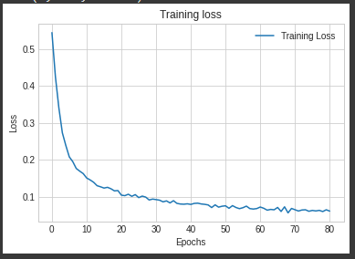
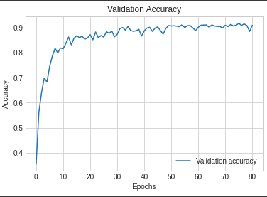

# Colab Siamese Neural Networks for One shot Image Recognition

A ready to go implementation of the ["Siamese Neural Networks for One-shot Image Recognition"](https://www.cs.cmu.edu/~rsalakhu/papers/oneshot1.pdf) paper [in PyTorch on Google Colab](https://colab.research.google.com/drive/1TDjk36ia5rTXQPHpAgfwZvPDmXbHetui?usp=sharing) with training and testing on the [Omniglot](https://github.com/brendenlake/omniglot)/custom datasets.

## Training Loss Graph ( Trained for 80 Epochs )

## Accuracy Graph ( Accuracy of 86.42% )

