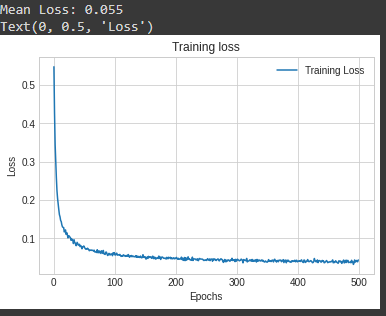

# Colab Siamese Neural Networks for One shot Image Recognition

A ready to go implementation of the ["Siamese Neural Networks for One-shot Image Recognition"](https://www.cs.cmu.edu/~rsalakhu/papers/oneshot1.pdf) paper [in PyTorch on Google Colab](https://colab.research.google.com/drive/1H0qO0xUbqAMcoNEevAALKv1vqchFRfWh?usp=sharing) with training and testing on the Omniglot/custom datasets.

## Training Loss Graph(loss saved every 50 epochs)

### Still working on improving the implementation.
